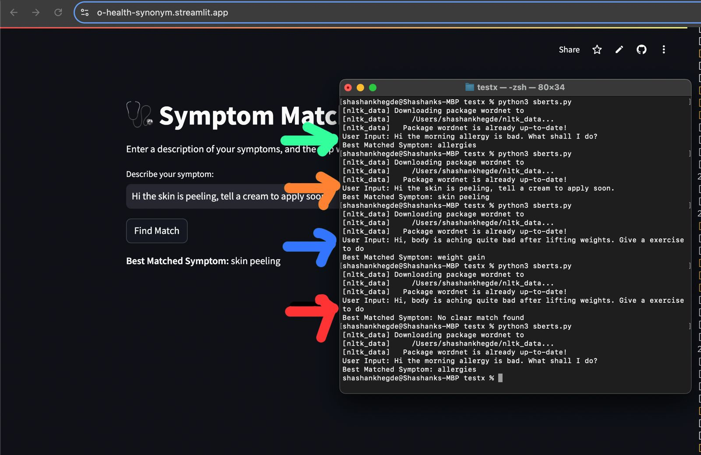
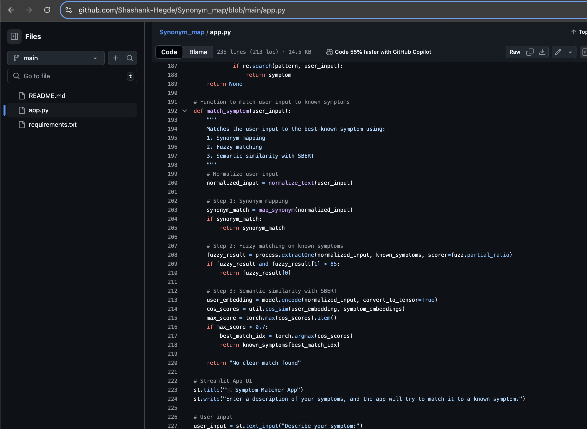

# Synonym_map

Developed a new webapp explicitly for testing the synonym mapping like we discussed earlier, with a LLM. This app is ONLY for testing different inputs and seeing how it maps to the symptoms. I have given access to you for this code, and we need to do testing to see its efficiency and any bugs.
This only works with typing in English, and once we can finetune the threshold and other parameters I will implement it on the main streamlit app and then we can migrate it to the android app.

Here is the link to the webapp for testing
https://o-health-synonym.streamlit.app/

1.⁠ ⁠Green arrow: Input  - Hi the morning allergy is bad. What shall I do?

    Mapped correctly to allergies
    
2.⁠ ⁠Orange arrow: Input "Hi the skin is peeling, tell a cream to apply"
    
    Mapped correctly to skin peeling

3.⁠ ⁠Blue arrow : Input _ Hi, body is aching quite bad after lifting weights. Give a exercise to do"

    Incorrectly Mapped to weight gain
Solution: Increase threshold from 80 to 85 and test again

4.⁠ ⁠Red arrow, same input

    Correctly Mapped with no clear match, as expected. This is because "body ache" is not a symptom
Solution would be to add body ache as a symptom

Next, should do similar testing thoroughly and check for any further bugs. Adjust the thresholds as required
Higher threshold : more strict in mapping to synonym

In app.py you have 2 thresholds to change
Line 209 and 
216 (max_score is 0 to 1)
